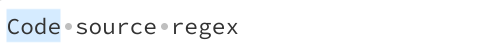
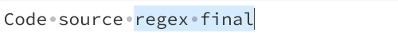
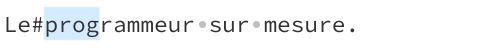
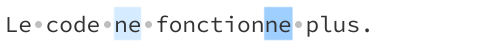

<div align="center">

# Expressions Régulières (REGEX)


</div>

Une expression régulière ou expression rationnelle ou motif est une chaîne de
caractères qui décrit, selon une syntaxe précise, un ensemble de chaînes de
caractères possibles. Dans n'importe quelle technologie de développement
informatique (framework, langage de programmation, etc.), on a besoin
d'utiliser des expressions régulières pour effectuer certaines tâches.
<!-- Communément appelé **regex** (contraction de *regular expression*), -->

> Euh, à quoi ça sert ? :thinking:

<br/>
<!--<details id="table-content" open>
    <summary>Table des Contenus</summary>
    <ul>
        <li><a href="#avant-propos">Avant propos</a> </li>
    </ul>

</details>-->

## 1 Les bases

#### 1.1 Début de chaîne de caractères

`^` permet de parser la séquence de début d'une chaîne de caractères.
Par exemple :

```r
^Code
```

<div align="center"></div>

Ce qui signifie que dans la chaîne de caractères "Code source regex", la
séquence de début est "Code".


#### 1.2 Fin de chaîne de caractères
Pour parser la séquence qui se trouve à la fin d'une chaîne de caractères, on
utilise le symbôle `$`. Par exemple : `masequence$`.

```r
regex final$
```

<div align="center"></div>

Donc ce motif permet de spécifier que la chaîne de caractères x doit finir
par *regex final*.


#### 1.3 Début et fin d'un mot
Une séquence est prise pour un mot, lorsqu'elle ne comporte que :
 - des lettres alphabetiques `A-Z` ou `a-z` ou le mélange uniquement;
 - ou des lettres mélangées avec des chiffres 0-9;
 - ou mélange de lettres, de chiffres et du caractères `_`.

Exemples considérés comme mot : `1pro`, `mokira3de48`, `__init__`, `code_c`,
`yAnICK`, `CodeGeek`.

Par contre : `mode-senior` sera pris pour deux mots distincts : `mode` et
`senior`.

Donc, fais attention lorsque tu va vouloir définir ton code regex.

1. Pour parser une séquence de chaîne se trouvant au début d'un mot,
on utilise `\b` suivie de la séquence.

```r
\bprog
```

<div align="center"></div>

Tu vois, "Le#programmeur" est pris pour deux mots distincts. Du coup, si on
cherche à parser la séquence `pro` qui se trouve au début d'un mot, alors on
peut s'attendre à un résultat positif lorsque la parseur tombe sur un cas
comme illustré dans l'exemple précédente. Cela marchera aussi pour la chaîne
"john~**prog**resse(pas mal)".

2. De la même façon, pour parser une séquence se trouvant à la d'un mot, on
utilise toujours le caractères `\b` mais cette fois si, placé à la suite de la
séquence à parser.

```r
ne\b
```

<div align="center"></div>

Là, tu remarqueras qu'il a deux mots qui se terminent par la séquence `ne`.

<!-- https://www.youtube.com/watch?v=iqFsto4BMyQ -->
